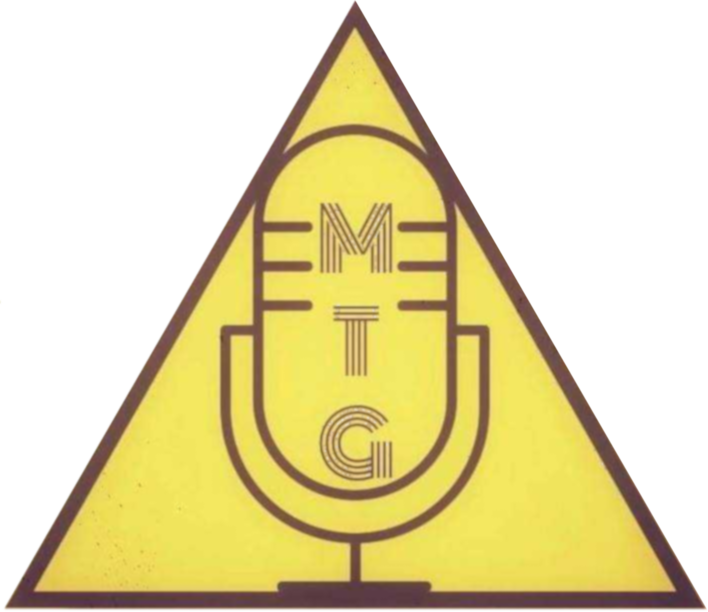

The official Mind The Gap podcast website.

## Files

The html files and the css file make up the website, the stuff in the files directory is mainly images for the site to use. The fonts directory is fairly self explanatory, using Bariol Regular for the site. 

